# 1.

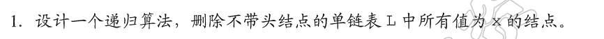

[面试题18. 删除链表的节点](https://leetcode-cn.com/problems/shan-chu-lian-biao-de-jie-dian-lcof/)

**递归写法代码**：

``` c
/**
 * Definition for singly-linked list.
 * struct ListNode {
 *     int val;
 *     struct ListNode *next;
 * };
 */
typedef struct LintNode *LinkList;

struct ListNode* deleteNode(struct ListNode* head, int key){
    if(head==NULL){
        return NULL;
    }
    LinkList p=head->next;
    if(head->val==key){
        free(head);
        return  deleteNode(p,key);
    }else{
        head->next=deleteNode(p,key);
        return head;
    }
}
```

**非递归写法**：

``` c
/**
 * Definition for singly-linked list.
 * struct ListNode {
 *     int val;
 *     struct ListNode *next;
 * };
 */
typedef struct ListNode *LinkList;

struct ListNode* deleteNode(LinkList head, int key){
   // 非递归写法
    LinkList tmp;
   //1.特例处理 删除的是第一个节点
   while(head->val==key&&head!=NULL){
       tmp=head;
       head=head->next;
       free(tmp);
   }
   //2.删除
   LinkList p=head;
   while(p!=NULL&&p->next!=NULL){
       if(p->next->val==key){
           tmp=p->next;
           p->next=p->next->next;
           free(tmp);
       }
       p=p->next;
   }
    return head;
}
```


**完整代码**：

``` c
#include<stdio.h>
#include<stdlib.h>
//单链表
typedef struct LNode{
    int data;
    struct LNode *next;
}LNode,*LinkList;

//数组转链表
LinkList NewNode(int num){
    LinkList ret=(LinkList)malloc(sizeof(LNode));
    ret->data=num;
    ret->next=NULL;
    return ret;
}
// 输入数组
// 返回链表(不带头节点)
LinkList nums2List(int nums[],int lenght){
    LNode dummy;
    LinkList p=&dummy;
    for(int i=0;i<lenght;i++){
        p->next=NewNode(nums[i]);
        p=p->next;
    }
    return dummy.next;
}

void travel(LinkList head){
    LinkList p=head;
    while(p!=NULL){
        printf("%d ",p->data);
        p=p->next;
    }
    printf("\n");
}

LinkList delete_key(LinkList head,int key){
    if(head==NULL){
        return NULL;
    }
    LinkList p=head->next;
    if(head->data==key){
        free(head);
        return  delete_key(p,key);
    }else{
        head->next=delete_key(p,key);
        return head;
    }
}
int  main(){
    int nums[]={1,2,3,5,7,8};
    int length=6;
    LinkList ret=nums2List(nums,length);
    ret=delete_key(ret,8);
    travel(ret);
}
```

# 2、

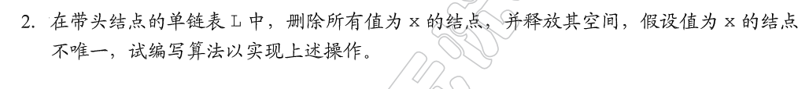

``` c
void Remove(LinkList head,int key){
    LinkList p=head;
    LinkList tmp=NULL;
    while(p!=NULL&&p->next!=NULL){
        if(p->next->val==key){
            tmp=p->next;
            p->next=p->next->next;
            free(tmp);
        }
        p=p->next;
    }
}
```

完整代码：

``` c
#include<stdio.h>
#include<stdlib.h>
//单链表
typedef struct ListNode {
    int val;
    struct ListNode *next;
}ListNode,*LinkList;

//数组转链表
LinkList NewNode(int num){
    LinkList ret=(LinkList)malloc(sizeof(ListNode));
    ret->val=num;
    ret->next=NULL;
    return ret;
}

// 输入数组
// 返回链表(不带头节点)
LinkList nums2List(int nums[],int lenght){
    ListNode dummy;
    LinkList p=&dummy;
    for(int i=0;i<lenght;i++){
        p->next=NewNode(nums[i]);
        p=p->next;
    }
    return dummy.next;
}

void travel(LinkList head){
    LinkList p=head;
    while(p!=NULL){
        printf("%d ",p->val);
        p=p->next;
    }
    printf("\n");
}
void Remove(LinkList head,int key){
    LinkList p=head;
    LinkList tmp=NULL;
    while(p!=NULL&&p->next!=NULL){
        if(p->next->val==key){
            tmp=p->next;
            p->next=p->next->next;
            free(tmp);
        }
        p=p->next;
    }
}
int  main(){
    int nums[]={1,2,3,5,7,8};
    int length=6;
    LinkList ret=nums2List(nums,length);
    LinkList head=(LinkList)malloc(sizeof(ListNode));
    head->next=ret;
    travel(head->next);
    Remove(head,8);
    travel(head->next);
}
```

# 3、

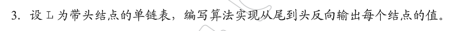

```c 
//反向输出
//利用递归压栈
void reverseTravel(LinkList head){
    if(head->next==NULL){
        return;
    }
   if(head->next->next!=NULL){
       reverseTravel(head->next);
   } 
   // 输出下一个节点的val
    printf("%d ",head->next->val);
}
```

# 4、

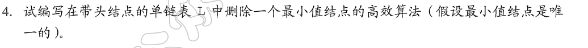

``` c
//删除最小的数字 两趟遍历
void solution4(LinkList head){
    LinkList p=head->next;
    // 1.链表没有数据
   if(p==NULL){
    return ;
   } 
   //2.寻找最小的数字
   int min=p->val;
   while(p!=NULL){
       if(p->val<min){
           min=p->val;
       }
       p=p->next;
   }
   //3.删除最小的数字
   p=head;
   while(p->next->val!=min){
       p=p->next;
   }
   LinkList tmp=p->next;
   p->next=p->next->next;
   free(tmp);
}
```

``` c
//删除最小的数字 一趟遍历 减少变量使用
void solution4(LinkList head){
    // 1.链表没有数据
   if(head->next==NULL){
        return ;
   } 
    LinkList p=head;
   //2.寻找最小的数字
   LinkList pre=head; // pre始终指向最小元素的前一个
   while(p->next!=NULL){
       if(p->next->val<pre->next->val){
           pre=p;
       }
       p=p->next;
   }
   //3.删除最小的数字
   LinkList tmp=pre->next;
   pre->next=pre->next->next;
   free(tmp);
}
```

# 5、

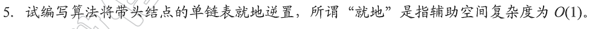

``` c
void solution5(LinkList head){
    LinkList p=head->next;
    head->next=NULL;
    //头插法
    LinkList tmp;
    while(p!=NULL){
        tmp=p->next;   
        p->next=head->next; 
        head->next=p;
        p=tmp;
    }
}

```

# 6、

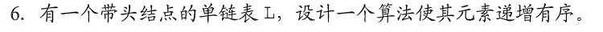

``` c
#include <stdio.h>
#include <malloc.h>
struct ListNode
{
    int val;
    struct ListNode *next;
};
typedef struct ListNode ListLink;

//插入排序
ListLink *insertionSortList(ListLink *head)
{
    // ListLink dummy;
    // dummy.next = head;
    // dummy.val = -2147483648;
    ListLink dummy = {1 << 31, head};
    ListLink *precede = head; //指向待插入节点
    ListLink *tail = &dummy;  //完成排序链表的尾部
    ListLink *p;              //用于寻找插入位置指针
    while (precede != NULL)
    {
        if (precede->val >= tail->val)
        {
            //无需执行插入
            tail = tail->next;
            precede = precede->next;
            continue;
        }
        //寻找插入位置
        p = &dummy;
        for (; p->next->val < precede->val; p = p->next);
        // 执行插入
        tail->next = precede->next;
        precede->next = p->next;
        p->next = precede;
        precede = tail->next;
    }
    return dummy.next;
}
int main()
{
    int a = 1 << 31;
    printf("%d", a);
}
```

# 7、

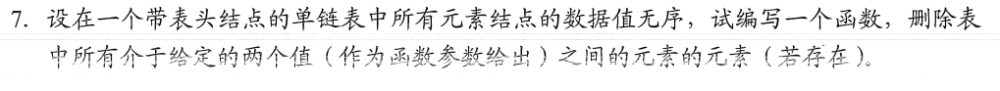

``` c
void removeBet(LinkList head,int a,int b){
    if(a>b){
        return ;
    }
    LinkList p=head;
    LinkList tmp=NULL;
    while(p!=NULL&&p->next!=NULL){
        if(p->next->val>=a&&p->next->val<=b){
           tmp=p->next; 
           p->next=p->next->next;
           free(tmp);
        }else{
            p=p->next;
        }
    }
}
```

# 8、  

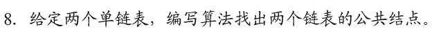

[160. 相交链表](https://leetcode-cn.com/problems/intersection-of-two-linked-lists/)

```c 
typedef struct ListNode ListNode,*LinkList;
LinkList getIntersectionNode(LinkList headA, LinkList headB) {
    LinkList p1=headA,p2=headB;
    if(headA==NULL||headB==NULL){
        return NULL;
    }
    while(p1!=NULL||p2!=NULL){
        if(p1==NULL){
            p1=headB;
        }
        if(p2==NULL){
            p2=headA;
        }
        if(p1==p2){
            return p1;
        }
        p1=p1->next;
        p2=p2->next;
    }
    return NULL;
}
```

# 9、

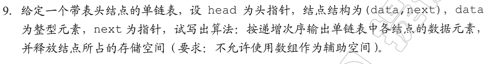

``` c
void travelAndFree(LinkList head){
  LinkList p;
  LinkList min;
  LinkList tmp;
  while(head->next!=NULL){
      p=head->next;
      min=head;
      // 每次删除一个节点
      while(p->next!=NULL){
            if(p->next->val<min->next->val){
                min=p;
            }
            p=p->next;
      }
      tmp=min->next;
       min->next=min->next->next;
       printf("%d ",tmp->val);
       free(tmp);
    }
    free(head);
    printf("\n");
}
```

# 10、

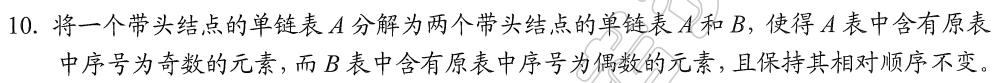

``` c
LinkList divide(LinkList A){
   LinkList B=(LinkList)malloc(sizeof(ListNode)); 
   B->next=NULL;
   LinkList pb=B;
   LinkList p=A->next;
   LinkList pa=A;
   A->next=NULL;
   bool flag=true;
   while(p!=NULL){
       if(flag){
           pa->next=p;
           pa=pa->next;
       }else{
           pb->next=p;
           pb=pb->next;
       }
        flag=!flag;
        p=p->next;
   }
   pa->next=NULL;
   pb->next=NULL;
   return B;
}
```

# 11、

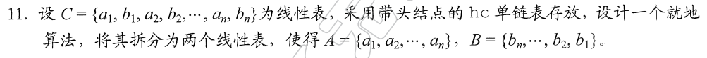

``` c
//链表分割
LinkList divide(LinkList A){
   LinkList B=(LinkList)malloc(sizeof(ListNode)); 
   B->next=NULL;
   LinkList p=A->next;
   LinkList pa=A;
   LinkList tmp;// 辅助p指针后移
   A->next=NULL;
   bool flag=true;
   while(p!=NULL){
       tmp=p->next;
       if(flag){
           //尾插法
           pa->next=p;
           pa=pa->next;
       }else{
           //头插法
           p->next=B->next;
           B->next=p;
       }
        flag=!flag;
        p=tmp;
   }
   pa->next=NULL;
   return B;
}
```

# 12、

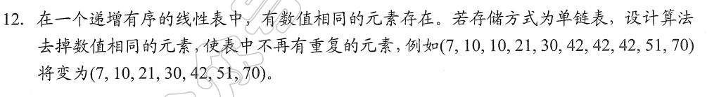

```  c
void removeRepeat(LinkList head){
    //带头节点
    LinkList p=head->next;
    //不带头节点
    // LinkList p=head;
    LinkList pre;
    LinkList tmp;
    while(p!=NULL){
        //删除重复
       pre=p->next;
       // pre指向下一个不相同的位置
       while(pre!=NULL&&pre->val==p->val){
           tmp=pre;
           pre=pre->next;
           free(tmp);
       }
       p->next=pre;
       p=p->next; 
    }
}
```

# 13、

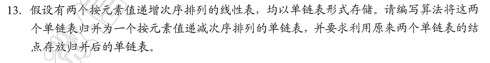

``` c
LinkList merge(LinkList A,LinkList B){
    LinkList ret=(LinkList)malloc(sizeof(ListNode)); 
    ret->next=NULL;
    LinkList pa=A->next;
    LinkList pb=B->next;
    free(A);free(B);
    //升序变降序 头插法
    LinkList tmp;//辅助移动
    while(pa!=NULL&&pb!=NULL){
        if(pa->val<pb->val){
            tmp=pa->next;
            pa->next=ret->next;
            ret->next=pa;
            pa=tmp;
        }else{
            tmp=pb->next;
            pb->next=ret->next;
            ret->next=pb;
            pb=tmp;
        }
    }
    if(pa==NULL){
        pa=pb;
    }
    while(pa!=NULL){
        tmp=pa->next;
        pa->next=ret->next;
        ret->next=pa;
        pa=tmp;
    }
    // while(pb!=NULL){
    //     tmp=pb->next;
    //     pb->next=ret->next;
    //     ret->next=pb;
    //     pb=tmp;
    // } 
    return ret;
}
```


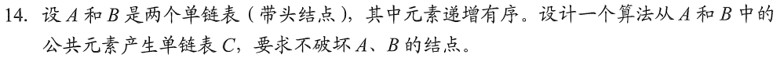

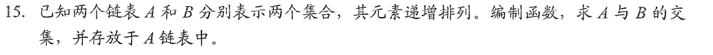

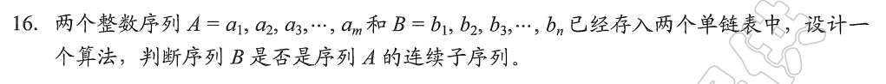

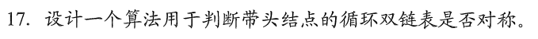

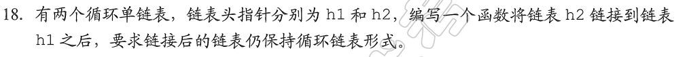

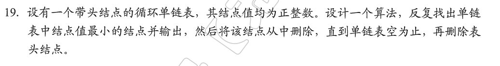

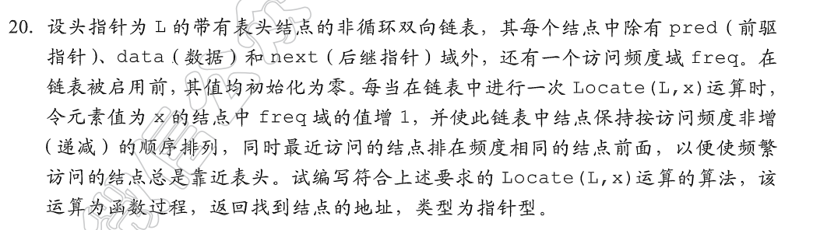

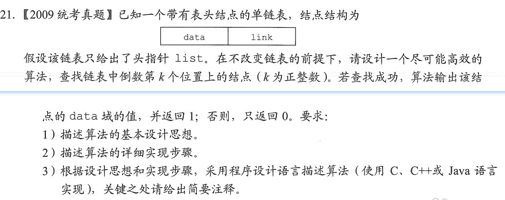

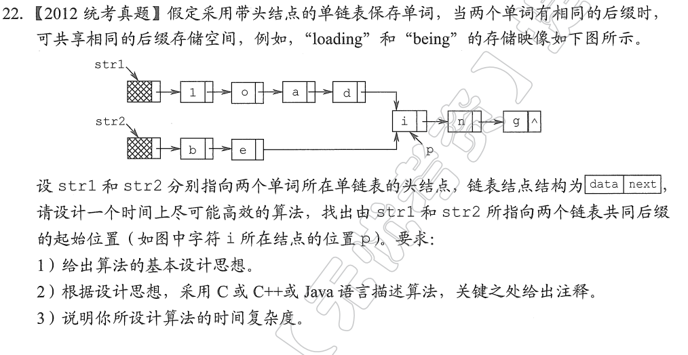

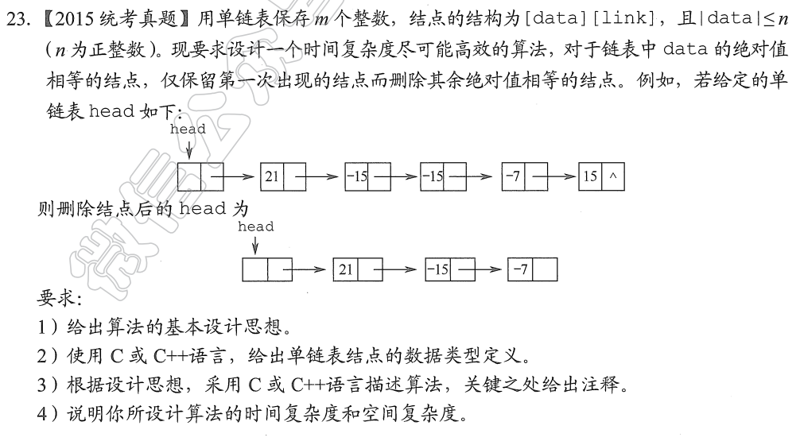

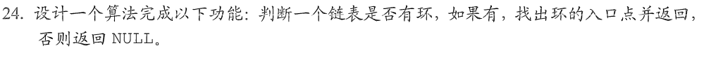

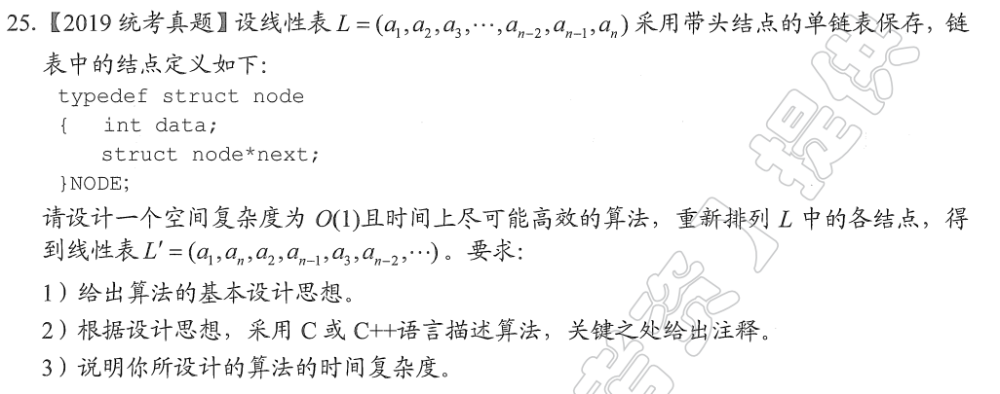

